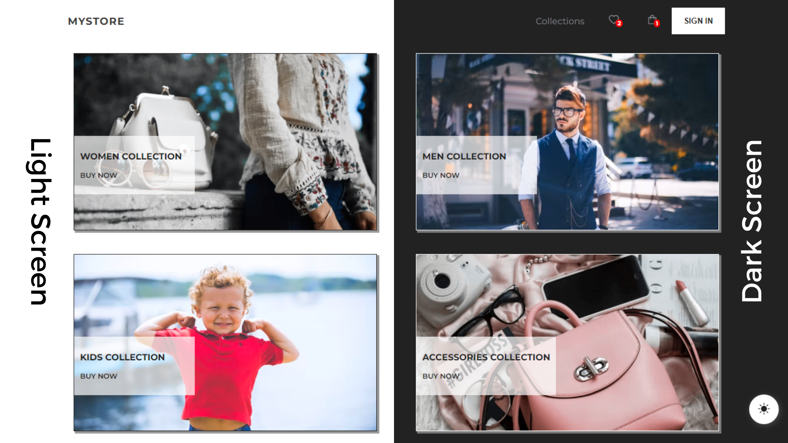
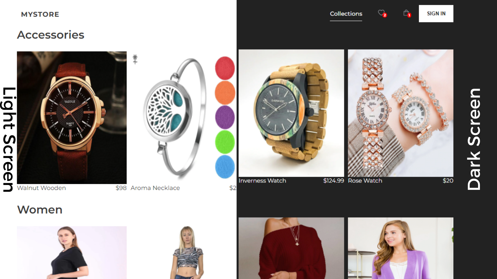
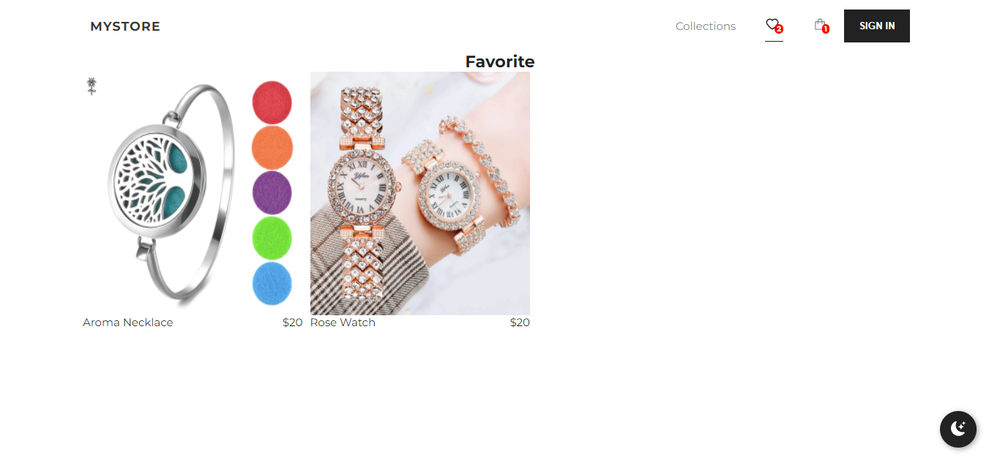
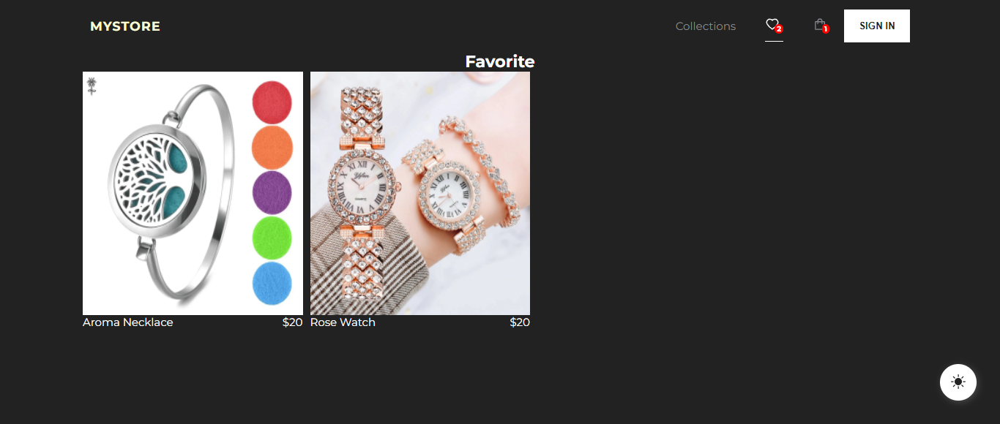
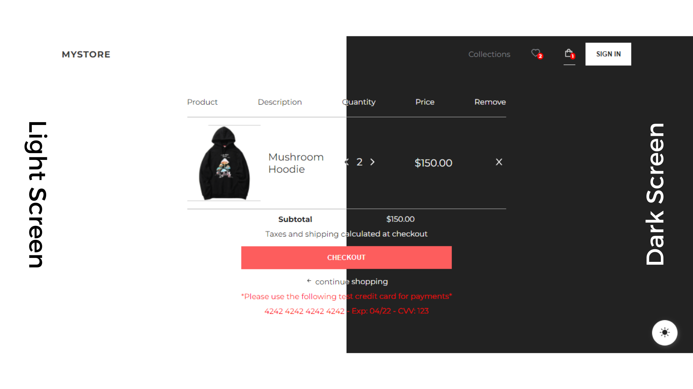
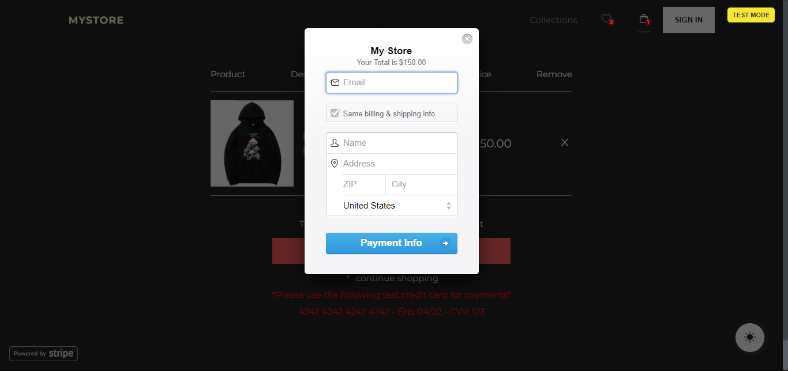

## Responsive E-commerce Website created React, Redux and Firebase

<strong>The Used Stack</strong>

**React & Redux:**

- Using Redux for state management.
- Created reusable components with Styled-Components.
- Routing (React Router).
- Redux Thunk for asynchronous actions (Get Collections Data from Firestore).
- Redux Persist to store Favorite and Checkout data.

**Firebase & Firestore:**

- Sign-in workflow with Firebase.
- Google Sign-in Authentication.
- Storing User Data.

**Complete MVP:**

**Overview & Goal:**

- Display different collections with name and proce.
  **Favorite**
- Add To Favorite.
- Remove From Favorite.
  **Cart**
- Add Items To Cart.
- Remove From Cart.
- Increase & Decrease Quantity.

**Stripe Paymenet:**

